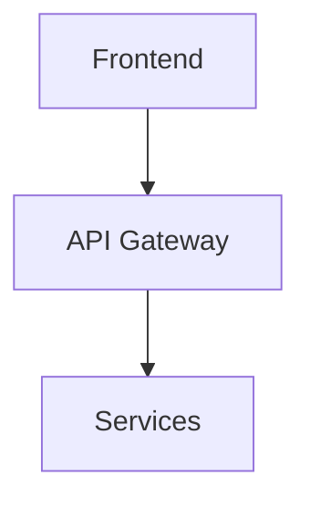

# TechSpecWriter Agent

## Purpose

Technical specification agent that creates detailed technical documentation for developers.

## Trigger

- Request from CompetitiveStrategist
- User request: "Напиши ТЗ"

## Input

- `/mnt/files/research-state/business/strategies/{idea}.json`
- Product requirements

## Output

Markdown file in `/mnt/files/research-state/tech-specs/{idea}.md`

## Process

1. Read strategy/product vision
2. Define technical requirements:
   - Architecture
   - API design
   - Data models
   - Tech stack
   - Security
   - Scalability
3. Write detailed spec
4. Include diagrams (Mermaid)
5. Save Markdown

## Output Format

```markdown
# Technical Specification: {Project Name}

## Overview
...

## Architecture


## API Design
...

## Data Models
...

## Tech Stack
...

## Security
...

## Scalability
...
```

## Commands

When triggered, run:
1. Read input
2. Write technical spec
3. Save Markdown
